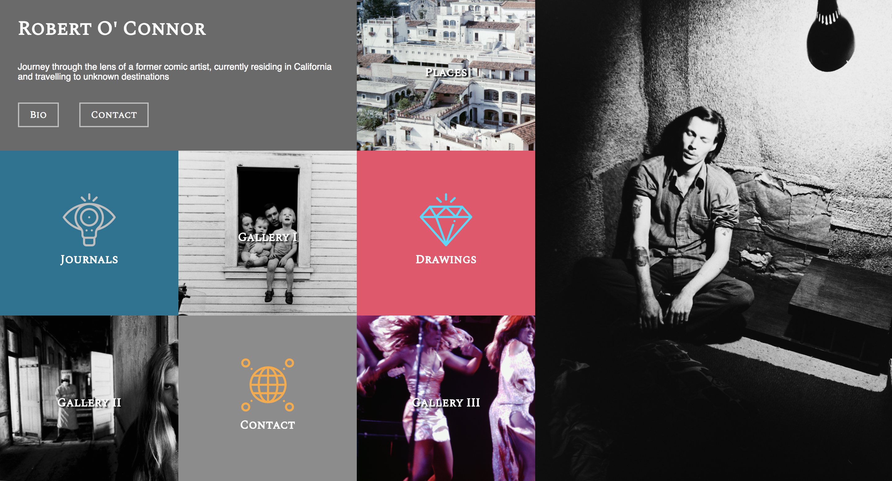
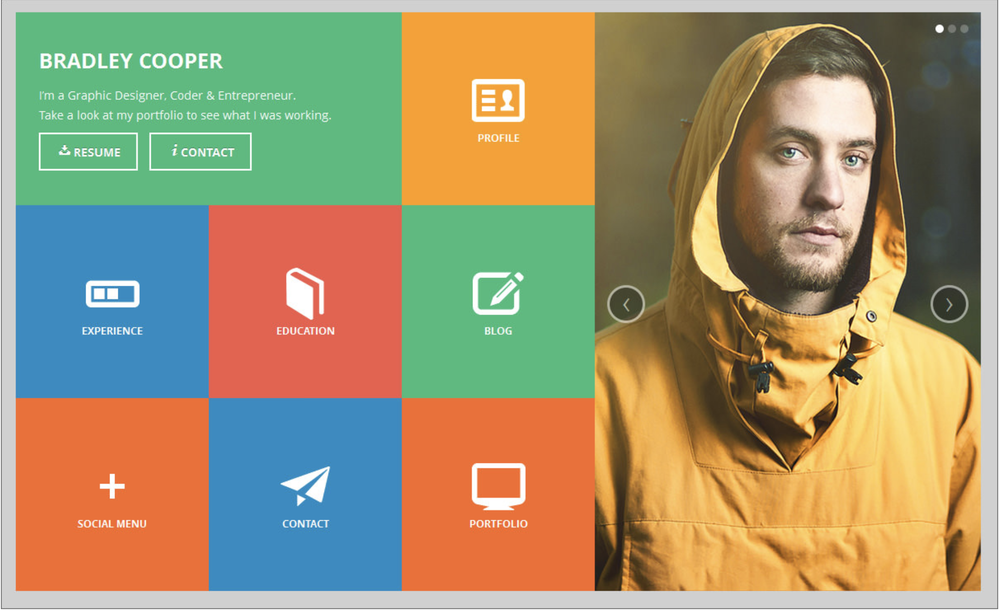

# os-comp-challenge-1

## About
This project is inspired by my friends' dad who was a comic artist in his 20's, and is currently documenting images of people and places during his travels. It is meant to be pushed live and showcase his work as his journal, and also as a surprise Christmas present to him!

## Resources
All the images were sent to me by both of his daughters. I utilized icon images that was available for free download on the internet.

## Color palletes
His daughters sent me their drawings that has a component of salmon orange, faded pink and dark slate blue. I used black and white images with some grey tiles, slighty off-white texts with shadow to make them pop and contrast each other.

## Specs
The site composition should be responsive to most popular mobile device- Samsung Galaxy series and iPhone 5-8

## My Static Comp

## The Original Comp

